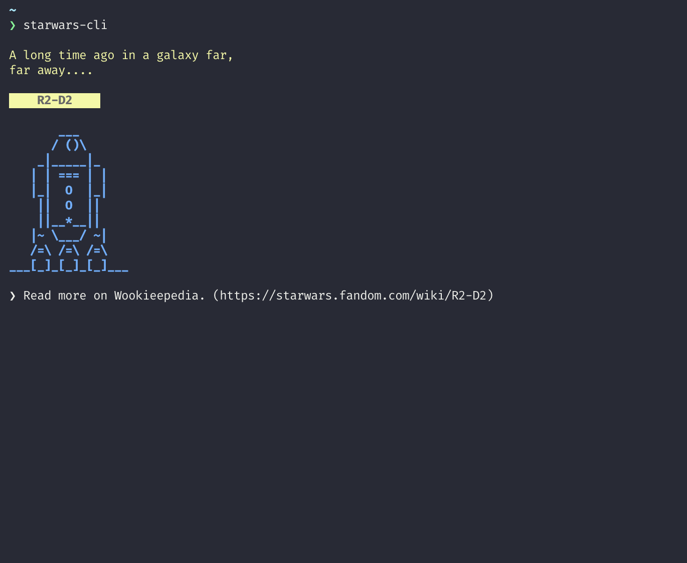

# Star Wars CLI

> A CLI to display random Star Wars ASCII. I wanted some little ASCII art in my terminal whenever I opened it and what originally was a shell script that displayed our favorite droid duo, R2-D2 and C3P0, turned into this CLI.



## Install

`npm install --global starwars-cli`

If you want it to run whenever you open a new terminal window:

`which starwars-cli >> ~/.zshrc` (or .bashrc or whatever you use).

## Usage

```
  Usage
      $ starwars-cli [options]
  Options
      --help     Provides usage help
      --all     Shows all ASCII items
      <keyword> --search     Shows a random ASCII for the keyword
      --style <options>     Tweaks the style (opts: box, no-color, ascii-only)
      <title>     Shows the specific ASCII (ref ascii.json)
  Examples
      $ starwars-cli R2-D2 --style ascii-only
               ___
              / ()\\
            _|_____|_
           | | === | |
           |_|  O  |_|
            ||  O  ||
            ||__*__||
          |~ \\___/ ~|
          /=\\ /=\\ /=\\
       ___[_]__[_]__[_]___
```

## Options

`starwars-cli` accepts a few arguments and options to tweak what is displayed and how it looks. Passing nothing will return a random ASCII.

### --all

Will display all the ASCII art from the json. This can be combined with style.

Example: `starwars-cli --all`

### --search

This will search the json to find ASCII art that fits the keyword. I am manually adding keywords as they fit but if you have suggestions, open an issue. This can be combined with style.

Example: `starwars-cli empire --search`

### --style

This lets you tweak the default styling. You can pass in multiple values here and it can be combined with other arguments.

**Options**

* `box`: will show a border around the ASCII itself.
* `no-color`: will remove the custom colors and will display using your terminal default.
* `ascii-only`: this will remove the title and extra wiki link for the ASCII.

Example: `starwars-cli R2-D2 --style box`

## License

Released under MIT.

----

Handcrafted with ♥ in Austin, Texas.
